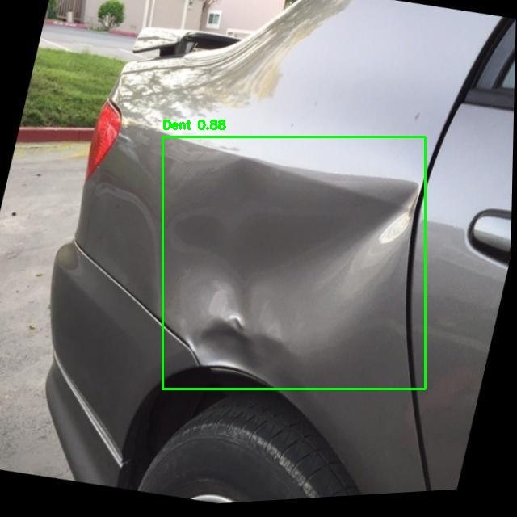
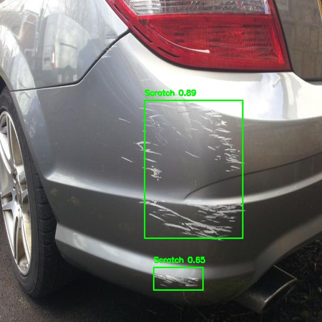

# Automated Vehicle Damage Detection and Repair Cost Estimation using Deep Learning

This project explores a deep learning-based approach for **automated detection and classification of vehicle damage** using object detection models. It performs a comparative analysis of **YOLOv5, YOLOv8, and a conceptual YOLOv11**, aimed at streamlining vehicle damage assessment and repair cost estimation improving insurance claim workflows.

---

## 1. Problem Statement

Manual vehicle damage inspections are:
- Time-consuming and error-prone
- Inconsistent across inspectors
- Costly and inefficient

This project aims to build an **automated system** to:
- Detect and classify **vehicle damage** (dent, scratch, broken glass)
- Enable **accurate repair cost estimation**
- Improve **speed**, **accuracy**, and **consistency** of damage assessments

---

## 2. Dataset

- **Source**: Roboflow Universe – Car Damage Detection dataset
- **Total Images**: 1076 annotated images
- **Classes**: 3 – `dent`, `scratch`, `broken glass`
- **Train/Val/Test Split**:
  - Train: 942 images
  - Val: 89 images
  - Test: 45 images
- **Preprocessing**:
  - All images resized to `640x640`
  - Standard augmentations applied to improve diversity

---

## 3. YOLO Variants Explored

All YOLO models share a three-part architecture:
- **Backbone**: Feature extraction
- **Neck**: Feature aggregation
- **Head**: Bounding box + class prediction

### 3.1 YOLOv5
- Backbone: CSPDarknet53 (lightweight)
- Neck: PANet
- Multi-scale detection capability

### 3.2 YOLOv8
- Backbone: Updated CSPDarknet with enhanced efficiency
- Neck: PANet + improved fusion
- Head: Multi-scale detection, improved accuracy & speed
- Outperforms earlier YOLO versions in most metrics

### 3.3 Conceptual YOLOv11 (Experimental)
- Backbone: Transformer or hybrid CNN-Transformer
- Neck: Enhanced FPN with attention
- Head: Dynamic anchor generation + multitask support (object detection, segmentation, keypoints)

---

## 4. Training Setup

- **Platform**: Google Colab
- **Hardware**: NVIDIA T4 GPU
- **Epochs**: 100
- **Image Size**: 640x640
- **Loss Function**: YOLO standard object detection loss
- **Optimizer**: SGD / Adam (variant-specific)

---

## 5. Evaluation Metrics

| Metric       | YOLOv5n | YOLOv8n | YOLOv8m | YOLO11s |
|--------------|---------|---------|---------|---------|
| Precision    | 0.6526  | 0.7342  | 0.6629  | 0.7397  |
| Recall       | 0.8986  | 0.8404  | 0.8551  | 0.7826  |
| F1 Score     | 0.7561  | 0.7838  | 0.7568  | 0.7606  |
| Accuracy     | 0.8222  | 0.8000  | 0.7556  | 0.7556  |
| Average IoU  | 0.5222  | 0.5707  | 0.5483  | 0.6183  |

---

## 6. Benchmark Comparison

**Base Paper**:  
*Automated Vehicle Damage Detection and Repair Cost Estimation Using Deep Learning* – S.K.A.S et al. (2024)  
**Reported Accuracy**: 71.9% (YOLOv5)

| Metric       | YOLOv8n (This Project) | Base Paper (YOLOv5) |
|--------------|------------------------|----------------------|
| Precision    | 0.7342                 | N/A                  |
| Recall       | 0.8404                 | 0.326                |
| F1 Score     | 0.7838                 | 0.39                 |
| Accuracy     | 0.8000                 | 0.719                |
| Average IoU  | 0.5707                 | N/A                  |

**Key Insight**: The proposed **YOLOv8n** model shows significant improvement in **recall, F1 score, and accuracy** over the baseline.

---

## 7. Repair Cost Estimation

Along with detection, the system estimates the **repair cost** for each detected damage based on bounding-box severity.

### **7.1 Maximum Repair Cost per Class**
- **Scratch:** Rs. 750  
- **Deformation / Dent:** Rs. 1,500  
- **Broken Glass:** Rs. 5,000  

### **7.2 Severity Estimation (Bounding Box Area Ratio)**  
Severity is derived from: 

### **7.3 Cost Multiplier Table**
| Area Ratio Range        | Severity | Cost Multiplier |
|--------------------------|----------|------------------|
| `< 0.02`                | Low      | 0.25×            |
| `0.02 – 0.05`           | Medium   | 0.50×            |
| `0.05 – 0.12`           | High     | 0.75×            |
| `> 0.12`                | Severe   | 1.00×            |

### **7.4 Final Cost Calculation**
final_cost = round(max_price_for_class * multiplier)

### **7.5 Output Visualization**
Each bounding box includes:
- Damage type + confidence  
- Estimated repair cost (`Rs.xxx`)  

The bottom-right corner shows:
Total Repair Cost: Rs.x,xxx

---

## 8. Conclusion

- **YOLOv8n** is the most balanced model with high **recall** and **F1 score**, ideal for sensitive damage detection tasks.
- **YOLOv8m** performs moderately well, suitable when computational resources allow.
- **YOLO11s** (conceptual) achieves the highest **precision** and **IoU**, showing promise for future development where **localization accuracy** is critical.

---

## 9. Sample Outputs

## 10. Project Teammates
- Suyranarayana Khannur 
- Rohit Kupplur
